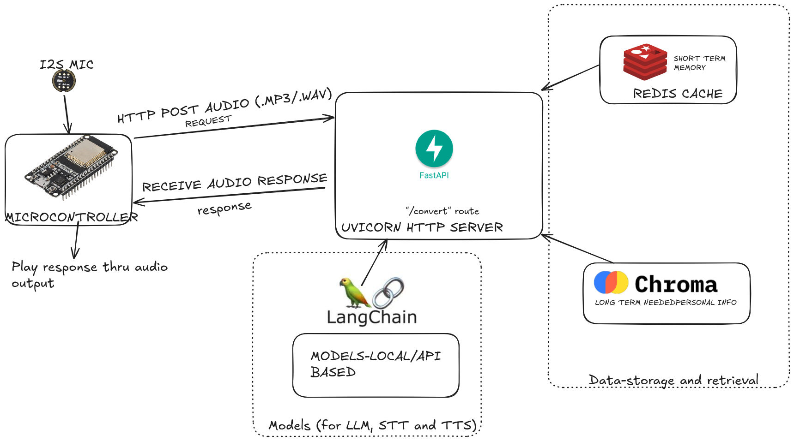

#  ESP32 Chatbot Server

FastAPI backend for ESP32 audio interaction. It accepts audio input from ESP32 devices, processes it via LLM, and returns synthesized audio responses.

---

##  How to Run
### 1. Clone and CD into the repository

####  Linux / macOS /Windows
```bash
git clone https://github.com/Sathya4683/esp32Chatbot-server
cd esp32Chatbot-server
````


### 2. Create and activate virtual environment

####  Linux / macOS
```bash
python3 -m venv venv
source venv/bin/activate
````

####  Windows (CMD)

```cmd
python -m venv venv
venv\Scripts\activate
```

---

### 3. Install dependencies

```bash
pip install -r requirements.txt
```

---

### 4. Run the FastAPI server

```bash
python3 main.py
# or (on Windows)
python main.py
```
The server would now be running on http://127.0.0.1:8000 and would take use http://127.0.0.1:8000/convert route to input the recorded audio from the I2S microphone (eg:INMP441) of the microcontroller and returns the LLM response in an audio file (.wav) which can be played through speaker options such as I2S DAC Module (eg:MAX98357A).
Basically an HTTP server implementation of sending requests (prompts) to the LLM and receiving responses.

---

##  Routes

### 1.`GET "/"`

* Health check endpoint.
* Returns:

  ```json
  {
    "status": "healthy"
  }
  ```

---

### 2.`POST "/convert"`

* Accepts audio file (WAV/MP3).
* Transcribes speech to text.
* Sends to LLM for response generation.
* Converts response text to audio.
* Returns audio as a streaming MP3 response.

---
###  Optional: Test the `/convert` Route Locally

You can simulate an ESP32 audio POST request using the following script:

```
request/python_simulation/post_simulation.py
```

This script is useful for logical and intuitive testing of the POST request and response retrieval functionality without actual hardware.

##  System Design




---
##  Tech Stack

* FastAPI
* Redis (for conversation memory/short term)
* ChromaDB (for personal information recall/long term)
* Speech Recognition & Text-to-Speech
* ESP32 HTTP client integration
* LangChain and Gemini AI for initial implementation testing
* SQLite (storage of ChromaDB personal information recall)
---
## Contributors
* https://github.com/sharanraj369
* https://github.com/Sathya4683
  

  

---


